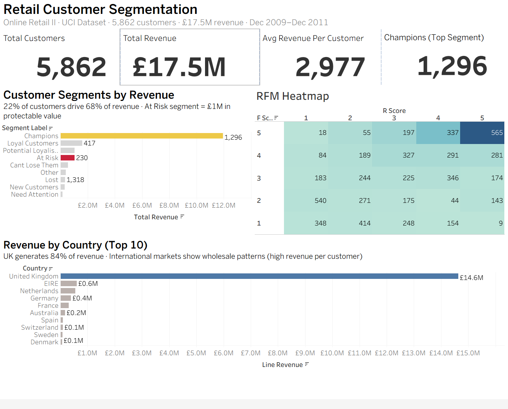

# Retail Customer Segmentation & RFM Analysis

End-to-end cloud data analytics project: customer segmentation on 1M+ retail transactions using Snowflake, SQL, and Tableau.

🔗 **[View Live Dashboard]((https://public.tableau.com/views/retail_segmentation/RetailDashboard?:language=en-GB&:sid=&:display_count=n&:origin=viz_share_link))**

---

## Headline Findings

- **22% of customers (Champions) drive 68% of revenue** — textbook Pareto distribution validated across 5,862 customers
- **£1M in protectable revenue** identified in the "At Risk" segment (224 customers, £4,595 average value) — second-highest priority for retention campaigns
- **Two distinct business models** uncovered geographically: UK domestic retail (5,336 customers, £2,740 avg) vs international wholesale (EIRE: 5 customers averaging £120K each)

---

## Tech Stack

| Layer | Technology |
|---|---|
| Data Warehouse | Snowflake (Standard Edition) |
| Modelling | SQL — medallion architecture (bronze/silver/gold) |
| Transformations | CTEs, NTILE window functions, dimensional modelling |
| Visualisation | Tableau Public |
| Source Data | UCI Online Retail II (peer-reviewed academic dataset) |

---

## Architecture
